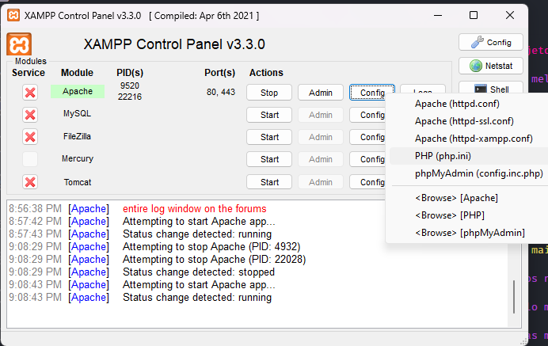
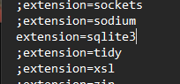

# [ABERTO] _**Desafio para vaga de estágio**_

O Grupo super tem mais de 10 anos de mercado, somos uma holding com portfólio de produtos voltados para área de recrutamento e seleção de candidatos. Com uso de conceito inovador de RH 360º, entregamos aos nossos clientes soluções completas que compreendem a atração, captação e seleção de talentos, com diversas marcas fortes e de alcance nacional.

Você terá dois ambientes para trabalhar, o painel Administrativo e o painel da Empresa que irá contratar os serviços de estágios. 
No painel da empresa terá funcionalidade voltadas a área do estágios, como por exemplo o cadastro de alunos, cadastro de termo de compromisso, assinatura de documentos, upload de documentos, criação de usuários, notificações de aceites ou recusas e etc.
Da parte Administrativa, essa será responsável por funcionalidades de suporte a Empresa, como por exemplo a aprovação dos termos solicitados, cadastro de novas empresas, consulta de estudantes, indicadores de perfomance e etc.
No final, o objetivo é a empresa cadastrar um termo de compromisso de um estagiário, com seus documentos, e ser aprovado ou rejeitado pelo painel adminstrativo. As demais funcionalidades ficarão a seu critério, e dentro do contexto do gerenciamento de contratações.
A experiência do usuários e as funcionalidades essenciais para que o ambos usuários dos paineis consigam executar de forma rápida e objetiva suas funções serão bem avaliadas.

Dito isso, bora codar!

## Informações sobre a vaga:

- Local de trabalho Vitoria - ES.

- Desenvolvimento/Manutenção em códigos PHP, sendo necessário utilizar HTML, CSS, JS e Git

- Realizar procedimentos CRUD em bando de dados MySQL

## Principais tecnologias que utilizamos:

- Banco de Dados Mysql.

- Backend -> PHP

- Frontend -> JavaScript/JQuery, CSS (Bootstrap) e HTML.

- Github/Git e AWS.

## Requisito da vaga

- Domínio do paradigma de programação orientada aos objetos (POO).

##

# INSTRUÇÕES:

## 1 - Crie um fork do projeto.

**https://github.com/gpsuper/superdesafio**

## 2 - Melhore o nosso projeto inicial.

- _Esperamos que você seja melhor que o ChatGPT._

- _Valorizamos código com qualidade, ausência de dívidas técnicas e respeitando metologias agéis de trabalho..._

- _Mostre para nós o teu potencial por meio do código._

- A estrutura é completamente editável, sinta-se à vontade para corrigir, refatorar e aplicar sua identidade de trabalho. 
  Desde alterar estrutura de diretórios, estrutura de front-end, estrutura de back-end, autenticação entre outros. 
  No final, o que importa são as tarefas solicitadas e sendo realizadas com restritamente as mesmas tecnologias citadas a cima, nada a mais nada a menos.

- _É permitido bibliotecas de front-end e também de back-end com a utilização do Composer_

- _Não serão avaliados projetos com utilização de frameworks_

## 2.1 Melhorias e Solicitações

Tarefa 1: Desenvolvimento de Página de Cadastro
_Objetivo: Criar uma página dedicada para o cadastro de usuários administradores e de empresas, incluindo a configuração dos acessos correspondentes a cada tipo de usuário._

Tarefa 2: Criação e Manipulação de Tabelas de Dados
_Objetivo: Implementar exemplos de tabelas e dados que tanto clientes quanto administradores possam utilizar. Por exemplo, você pode começar listando as empresas ativas para visualização no painel do administrador.
Nota: Sinta-se à vontade para criar tabelas adicionais no banco de dados conforme julgar necessário. É esperado que novas tabelas sejam criadas para suportar a funcionalidade completa da aplicação._

Tarefa 3: Identificação e Resolução de Erros
_Objetivo: A aplicação contém alguns erros intencionais. Sua tarefa é identificá-los e propor soluções eficazes._

Tarefa 4: Desenvolvimento e Estruturação do Site
_Objetivo: Ajustar o link fornecido e criar pelo menos 5 páginas web de sua escolha e faça o sentido para projeto, incluindo as páginas de cadastro. Estas páginas devem estar interligadas e funcionais._

Tarefa 5: Inovação e Melhorias
_Objetivo: Encorajamos você a implementar quaisquer melhorias ou funcionalidades adicionais que considere valiosas para o projeto. Sua criatividade e inovação também serão critérios de avaliação._

## 3 - Faça um pull request ao nosso projeto.

- _Indique o número da vaga na mensagem de pull request._

## 4 - Aguarde uma revisão.

_Caso rejeitado, apontaremos apenas um problema._

## 5 - O que é avaliado no desafio?

- Avaliamos o domínio de Programação Orientada aos Objetos.

- Avaliamos a organização e clareza no código

- Conhecimentos em CRUD

# Extra

- Recomendamos utilizar o **XAMPP/LAMPP** para rodar o servidor em sua maquia

- Diretório padrão é **<code>C:/xampp/htdocs</code>** -> Clone o repositório aqui

#### Utilizar o ponto para que funcione sem menores problemas

**<code> git clone https://github.com/gpsuper/superdesafio . </code>**

- Para ter acesso abra o link no seu navegador **http://localhost:80**

- No arquivo php.ini retire o comentário na linha <code>**extension=sqlite3**</code> para habilitar a classe do SQLite3 do PHP

- Execute o painel de controle com permissão de administrador e ligue o **Apache**

###### _Painel de controle do XAMPP_

###### _Linha do arquivo php.ini_

